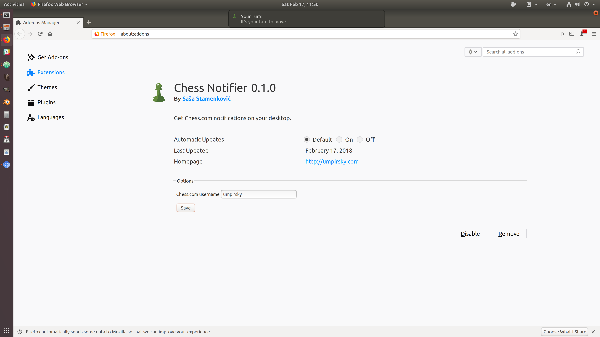
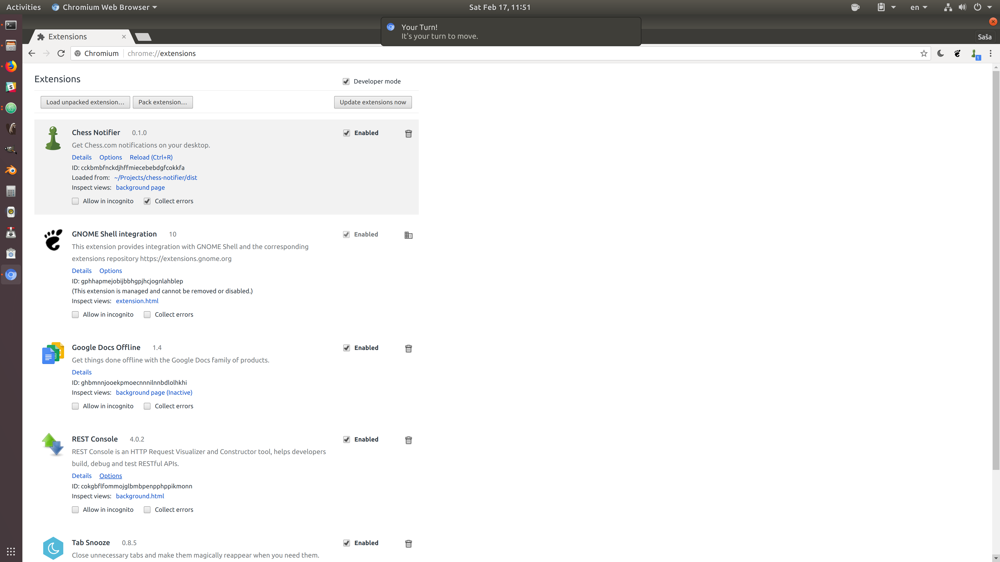

# Chess Notifier

Get [Chess.com](https://www.chess.com) browser notifications on your desktop. Never lose on time again!

## Install

* **Chrome** - install from the [Chrome Web Store](https://chrome.google.com/webstore/detail/chess-notifier/nkmckbhgglpggfklbhkgmkeoodhhddfj).
* **Firefox** - install from the [Firefox Marketplace](https://addons.mozilla.org/en-US/firefox/addon/chess-notifier/)

### Install from cource

```sh
git clone https://github.com/umpirsky/chess-notifier.git
cd chess-notifier
npm install
# Firefox build
npm run build:firefox
# Chrome build
npm run build:chrome
```

## Screenshots

### Firefox


## Chrome

